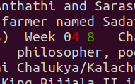

# PDF-Compare

A simple software tool to compare two pdfs.

### Installation

- Download the repository
- install all the dependencies using npm i
- start the app using `nodemon` or `node index.js`

### Usage

At present, few sample files from the pdfs folder are used. Once you clone the repo you can add your different files & change the import of files accordingly.

When you call the API `localhost:3005/compare-pdfs` if the pdfs are processed s uccessfully, you can see the below objects in the console.

### Examples

1. When you load `sample-1.pdf` & `sample-2.pdf`.

2. When you load `sample-3.pdf` & `sample-4.pdf`.

